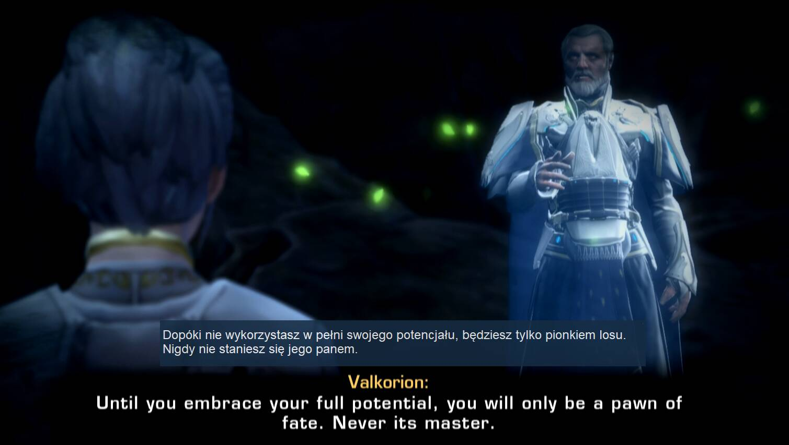
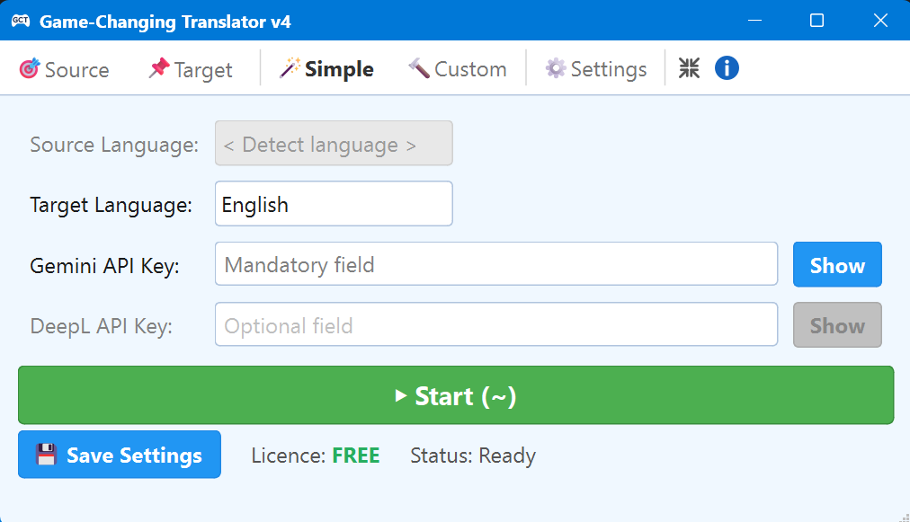
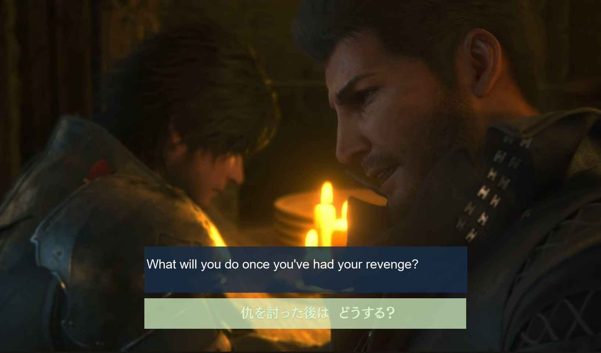
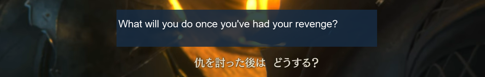
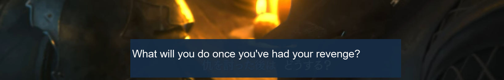
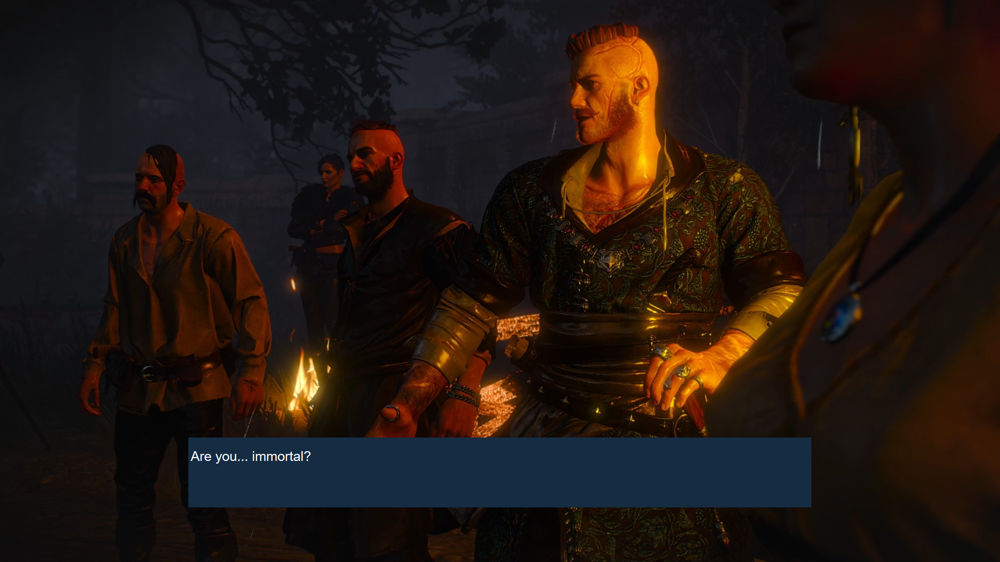
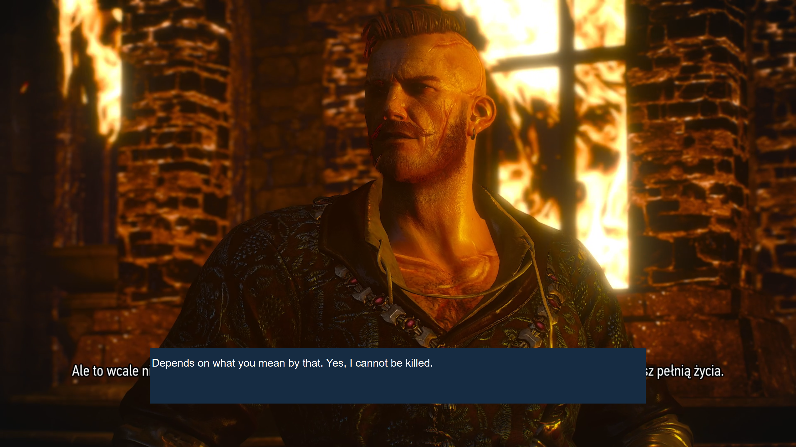
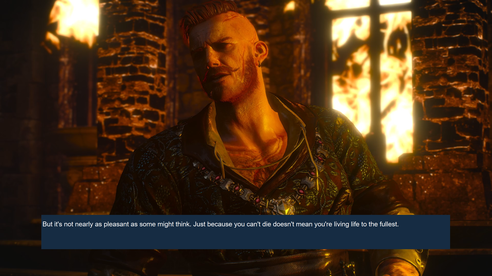
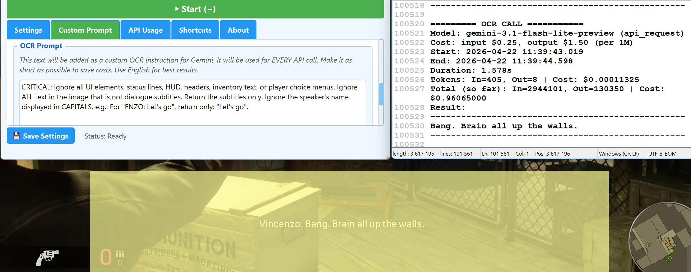

# Game-Changing Translator v4
Copyright © 2025-2026 Tomasz Kamiński <b>Author of</b>  <b><a href="https://github.com/tomkam1702/OHLC-Forge">OHLC Forge</a> – Professional tool for crypto traders</b>

## 🌟 Overview

**Game-Changing Translator** is a state-of-the-art desktop application designed for real-time screen translation. Using powerful AI-driven OCR and context-aware engines, it captures text from any part of your screen—be it a game, a movie, or a document—and translates it instantly into over 100 languages. 

Whether you're exploring the world of *The Witcher*, learning a new language through entertainment, or simply need to understand content that can't be copied, GCT v4 provides a seamless, immersive experience with floating overlays that stay on top of your content.

---

## 🎬 Featured Game Demonstrations

  <table>
    <tr>
      <td align="center" width="33%">
        
         
        <strong>🧙‍♂️ <a href="https://youtu.be/0bMoL1pR7tM">The Witcher 3</a></strong>
         
        <em>Revolutionary AI OCR & natural Polish-to-English translation</em>
      </td>
      <td align="center" width="33%">
        
         
        <strong>⚔️ <a href="https://youtu.be/Iy4bIr06Ae4">Kingdom Come: Deliverance II</a></strong>
         
        <em>Czech-to-English Translation</em>
      </td>
      <td align="center" width="33%">
        
         
        <strong>🌌 <a href="https://youtu.be/rCsfY6Zsmps">Star Wars: The Old Republic</a></strong>
         
        <em>French-to-English Translation</em>
      </td>
    </tr>
  </table>

---

## 🪄 Introducing Version 4: A New Era of Translation

**Version 4** is not just an update — it is a complete architectural redesign. Built with a brand-new engine from the ground up, it offers a smoother, more responsive experience and a state-of-the-art interface tailored for modern gaming.

### ✨ Redesigned GUI & Simple Mode
The new interface offers two distinct modes: **Simple** for hassle-free operation and **Custom** for granular control.

  

### ⚡ Up and running in 3 simple steps:
1.  **Set your target language** – Source language is auto-detected in Simple mode.
2.  **Enter your API keys** – Mandatory Gemini key and optional DeepL key.
3.  **Select areas and start** – Position your Source and Target overlays and hit **Start (~)**.

  
  
  

---

## 🛠️ Features

### 🎁 FREE Features
*   **Gemini AI OCR**: Industry-first AI-powered text recognition that handles stylised fonts and low-contrast backgrounds.
*   **Gemini Translation**: Top-quality, context-aware translation in over 100 languages.
*   **Sliding Context Window**: Remembers up to 5 previous subtitles to maintain narrative coherence.
*   **Cost Monitoring**: Real-time token-level analytics and cost tracking.
*   **Two-Tier Caching**: In-memory and file-based caching to save on API costs.
*   **Native RTL Support**: Flawless bidirectional rendering for Arabic, Hebrew, Persian, etc.
*   **Translation Prompt**: Inject custom instructions to define tone or game-specific context.
*   **API Logs**: Comprehensive dual-layer logging for both OCR and Translation.

### 👑 PRO Features
*   **DeepL Translation**: Elite precision for Japanese, Chinese, and European scripts with free context subtitles.
*   **Find Subtitles**: Automatically scans the screen to detect and lock onto subtitle areas.
*   **Target on Source**: Automatically overlays the translation directly onto the original subtitle area.
*   **Scan Wider**: Expands the capture area to prevent word truncation and AI hallucinations.
*   **OCR Prompt**: Custom instructions for Gemini OCR to filter HUD elements or speaker names.
*   **Custom Appearance**: Full control over background and text colours with native pickers.

---

## 💎 PRO Feature Showcase

#### 🪟 Target on Source & 🔍 Find Subtitles
These features work together to create an "invisible" translator. **Find Subtitles** scans your screen to detect where text appears, while **Target on Source** places the translation directly on top of the original subtitles.

**Step 1: Initial Scan**

*The capture frame starts at a default size.*

**Step 2: Adaptive Growth**

*The frame expands in real-time to fit longer subtitles.*

**Step 3: Locked & Immersive**

*The frame locks at the perfect width, providing a seamless translation overlay.*

### ✍️ OCR Prompt
Take direct control over what the AI "sees". Filter out complex HUD elements, minimaps, and speaker names to focus only on the dialogue.

  
   
  <strong>Result: "Bang. Brain all up the walls."</strong> – the speaker name "Vincenzo:" is stripped, and all HUD elements are ignored. The debug log on the right confirms the exact OCR output.

---

## ⚠️ Important Information

> [!CAUTION]
> ### Licensing & API Costs – Important Note
> Please distinguish between the **GCT Software Licence** and **Third-Party API Costs**:
> *    **Features:** These are unlocked in the GCT software for everyone. However, using them requires a connection to the **Google Gemini API**, which carries its own usage costs.
> *    **Features:** These require a one-time purchase of a **GCT PRO Licence** to unlock advanced functionality within the program. This fee covers only software access and does **not** include or cover any API costs.
> *   **Independent API Services:** GCT is a professional interface for AI services provided by **Google** and **DeepL**. These are independent commercial entities. You are responsible for all costs incurred through their respective APIs (with the exception of the 500,000 characters/month provided in DeepL's free tier).
> *   **No Affiliation:** Game-Changing Translator and its author are entirely independent and have **no affiliation** with Google or DeepL. GCT is a tool designed to facilitate the use of these third-party paid services.

> [!WARNING]
> ### Compatibility & Version 4 Requirements
> Please review these technical requirements before proceeding:
> *   **API-Only Architecture:** Version 4 is built entirely around third-party AI APIs. Operation is **impossible** without a valid **Gemini API Key**.
> *   **Stay on v3.9.6:** If you do not have (and do not plan to obtain) a Gemini API key, you should **not** update to version 4. Please remain on **version 3.9.6**, which is the final release supporting free offline OCR (Tesseract) and offline translation models (MarianMT).
> *   **Try Before You Buy:** Do not purchase the **GCT PRO Licence** before thoroughly testing the **FREE** version. Ensure the software works correctly on your system and that the Gemini-powered OCR and translation meet your expectations.

---

## 🛑 Deprecated Features

Version 4 marks a significant shift towards high-quality AI-driven workflows. As a result, the following features have been retired:
*   **Tesseract** OCR and **MarianMT** translation: These traditional/local technologies no longer keep up with the state-of-the-art results provided by modern AI.
*   **OpenAI** and **Google Translate** support: Retired to streamline the application towards the most effective and cost-efficient engines.

---

## 🔗 Links

*   📖 **[Full User Manual](https://tomkam1702.github.io/OCR-Translator/docs/user-manual.html)**
*   💰 **[Get GCT PRO on Gumroad](https://tomkam17.gumroad.com/l/gct)**
*   🌐 **[Official Website](https://tomkam1702.github.io/OCR-Translator/)**

---

## 📜 Licence

This project is proprietary software. The source code is provided for educational and evaluation purposes under a restrictive **End User License Agreement (EULA)**.

**You may:**
*   Use the Free Edition for personal and evaluation purposes.
*   Review the source code for learning.

**You may NOT:**
*   Redistribute or sell the software.
*   Modify the software to bypass PRO license checks.
*   Use the code for commercial gain without permission.

For full details, see the [LICENSE](LICENSE) file.

[-blue.svg)](https://www.qt.io/qt-for-python)

---
### 🔗 Author's Portfolio
 **[OHLC Forge](https://github.com/tomkam1702/OHLC-Forge)** — Professional OHLC daily data reconstruction for Binance and Bybit.
