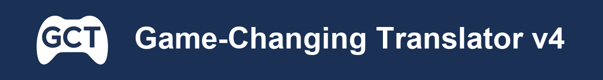
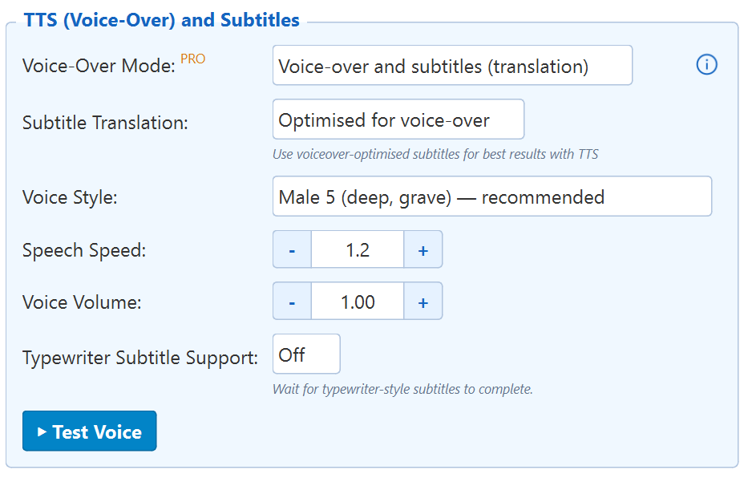
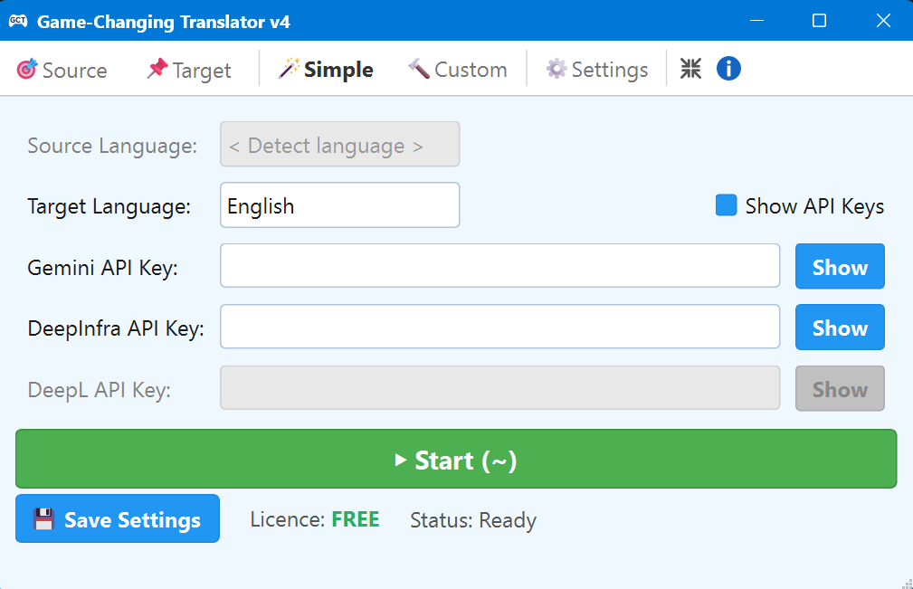
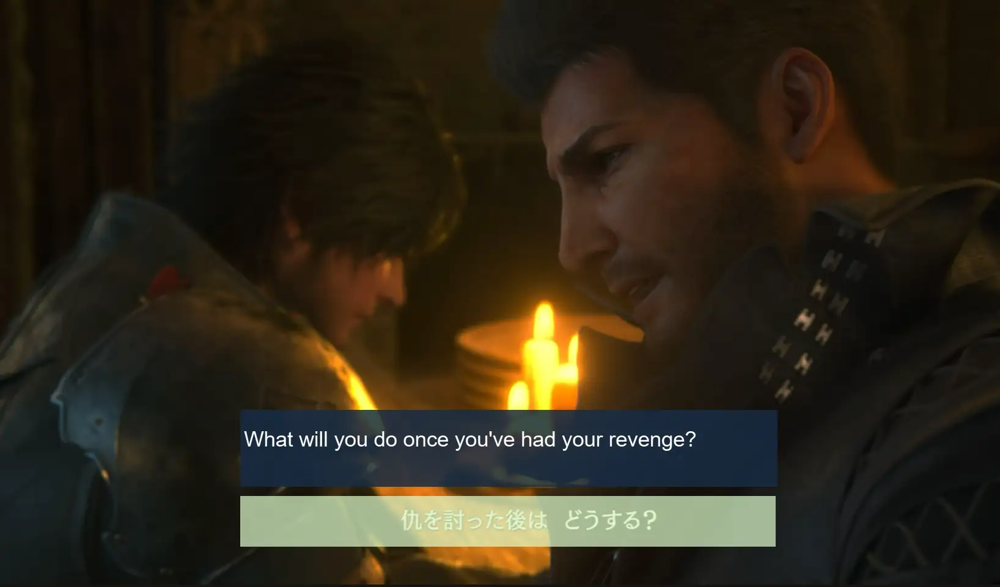
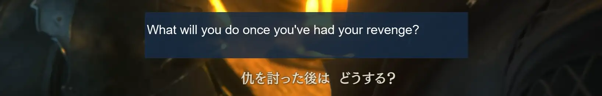
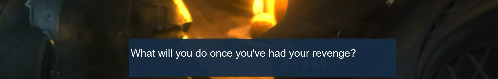
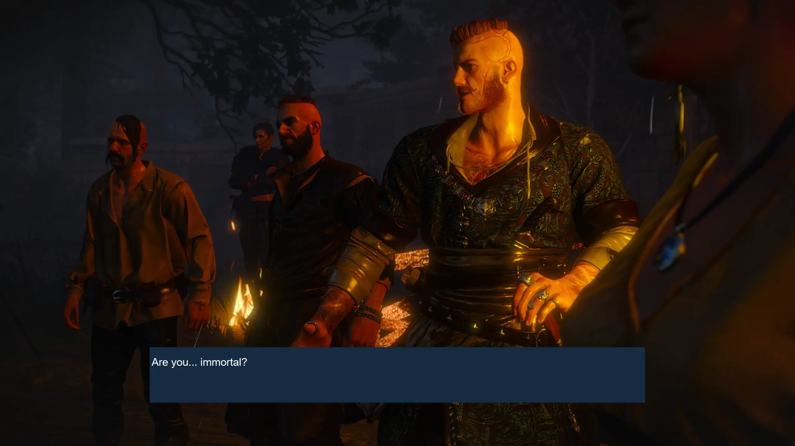
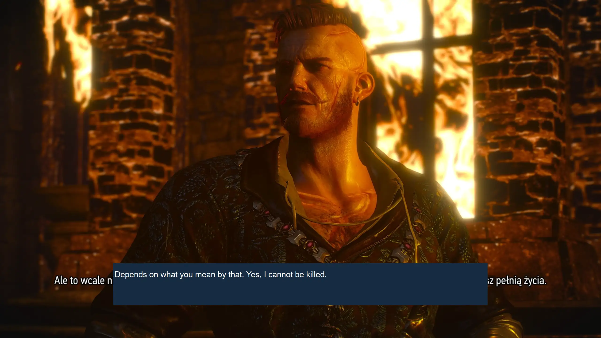
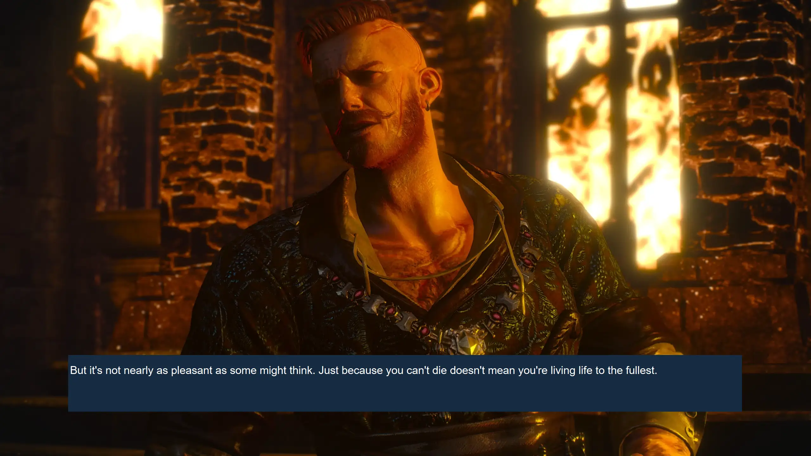
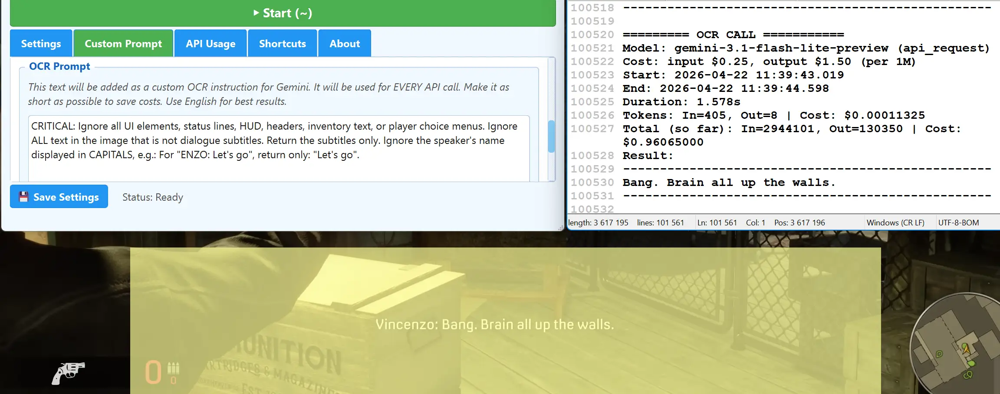

  

Copyright © 2025-2026 Tomasz Kamiński **Author of  [OHLC Forge](https://github.com/tomkam1702/OHLC-Forge) – Professional tool for crypto traders**

## 🌟 Overview

**Game-Changing Translator (GCT)** is a state-of-the-art desktop application designed for **real-time screen translation** and **neural voice-over (TTS)** for games, movies, and on-screen content. 

Powered by multi-model AI vision recognition (**Gemini**, **Gemma**, and **Qwen**), context-aware translation engines, and an embedded **100% offline neural voice engine** (Supertonic 3), it translates and vocalizes dialogue from any part of your screen into multiple languages with zero latency and zero voice API costs.

Whether you're exploring the cinematic world of *The Witcher*, playing Japanese RPGs, or learning a new language through entertainment, GCT provides a seamless, immersive experience with floating overlays and synchronized real-time voice-over.

> [!IMPORTANT]
> ### 🎙️ NEW in v4.5: Real-Time Neural Voice-Over (TTS)
> Experience games like never before! Listen to translated dialogue spoken aloud by natural AI voices, or read original subtitles without translation. Runs **100% locally on your PC** with **zero API costs** across **31 languages**.
> 
> 🎁 **FREE tier:** Includes a **3-minute trial on every app launch**.  
> 👑 **PRO tier:** Unlocks unlimited, continuous voice-over.

> [!TIP]
> ### ⚡ Near-Gemini Quality @ 4x Lower Cost!
> Support for **Gemma 4 (DeepInfra)** and **Qwen3-VL-30B** provides lightning-fast OCR and near-Gemini precision for a fraction of the price (~$0.16/hour for OCR).
> 
> 💡 **PRO TIP:** Combine Gemini (Translation) + Gemma (OCR) for the ultimate 3x cost reduction!  
> 👉 [Read the **Best Value for Money** guide in the manual](https://tomkam1702.github.io/OCR-Translator/docs/user-manual.html#best-value)

---

## 🎙️ Neural Voice-Over (TTS) in Action

  <table>
    <tr>
      <td align="center" width="50%">
        
         
        <strong>🗡️ <a href="https://youtu.be/qzKY3d8DEoQ">Final Fantasy XVI</a></strong>
         
        <em>Real-time neural voice-over in cinematic dialogue</em>
      </td>
      <td align="center" width="50%">
        
         
        <strong>🌌 <a href="https://youtu.be/011Evjv-Rys">Star Wars: The Old Republic</a></strong>
         
        <em>Subtitles + Voice-Over synchronized dialogue with zero API audio cost</em>
      </td>
    </tr>
  </table>

---

## 🎬 Real-Time Subtitle Translation Demonstrations

  <table>
    <tr>
      <td align="center" width="33%">
        
         
        <strong>🧙‍♂️ <a href="https://youtu.be/0bMoL1pR7tM">The Witcher 3</a></strong>
         
        <em>AI OCR & natural Polish-to-English translation</em>
      </td>
      <td align="center" width="33%">
        
         
        <strong>⚔️ <a href="https://youtu.be/Iy4bIr06Ae4">Kingdom Come: Deliverance II</a></strong>
         
        <em>Czech-to-English Translation</em>
      </td>
      <td align="center" width="33%">
        
         
        <strong>🌌 <a href="https://youtu.be/rCsfY6Zsmps">Star Wars: The Old Republic</a></strong>
         
        <em>French-to-English Translation</em>
      </td>
    </tr>
  </table>

---

## 🎙️ Neural Voice-Over (TTS) – Key Highlights

The new Voice-Over module transforms GCT into a full dubbing and voice-acting companion for foreign games and video content:

  

| Feature | Description & Advantages |
| :--- | :--- |
| **🎧 4 Flexible Output Modes** | • **Voice-over only:** Pure spoken dialogue without on-screen subtitle boxes – zero HUD clutter. • **Voice-over and subtitles:** Simultaneous speech and floating translation overlay. • **Read original subtitles (no translation):** Reads on-screen text aloud in its native source language with **zero translation API cost**. • **None:** Traditional visual subtitle overlay only. |
| **⚡ Optimised for Voice-Over** | Selectable translation style that crafts concise, punchy, and idiomatic sentences specifically tailored for TTS. This dramatically reduces audio duration and speech latency. |
| **💻 100% Offline & Zero API Costs** | Powered by the embedded **Supertonic 3** neural engine running entirely on your local CPU (with AVX2 support). No third-party TTS subscriptions, no token charges for voice synthesis. |
| **👑 Free 3-Min Trial on Every Launch** | All users can freely test every voice mode and speed setting for 3 minutes on every application startup. A **PRO licence** unlocks unlimited, permanent playback. |
| **🌐 31 Supported Languages** | Comprehensive multilingual voice synthesis covering 31 languages. |

👉 For details on the new TTS feature, see the [User Manual](https://tomkam1702.github.io/OCR-Translator/docs/user-manual.html#settings-tts).

---

## 🪄 Redesigned GUI & Simple Mode

The interface offers two distinct modes: **Simple** for hassle-free operation and **Custom** for granular control.

  

### ⚡ Up and running in 3 simple steps:
1.  **Set your target language** – Source language is auto-detected in Simple mode.
2.  **Enter your API keys** – A valid API key from **Google** or **DeepInfra**.
3.  **Select areas and start** – Position your Source and Target overlays and hit **Start (~)**.

  
  
  

---

## 🛠️ Features Breakdown

### 🎁 FREE Features
*   **AI-Powered OCR (Gemini, Gemma &amp; Qwen)**: Multi-model AI text recognition that handles stylised fonts, low-contrast backgrounds, and Asian scripts.
*   **AI Translation (Gemini &amp; Gemma)**: Top-quality, context-aware translation in over 100 languages.
*   **Neural Voice-Over 3-Min Trial**: Test all voice styles, speeds, and output modes for 3 minutes on every application launch.
*   **Voice-Over Optimised Translation Mode**: Concise translation style tailored specifically for fast speech synthesis and low latency.
*   **Sliding Context Window**: Remembers up to 5 previous subtitles to maintain narrative and grammatical flow across dialogue.
*   **Cost Monitoring**: Real-time token-level analytics for **Google**, **DeepInfra**, and **DeepL**.
*   **Two-Tier Caching**: In-memory LRU cache + persistent disk cache for zero-cost repeated phrases.
*   **Native RTL Support**: Flawless bidirectional rendering for Arabic, Hebrew, and Persian.
*   **Translation Prompt Profiles**: Create, save, and switch between custom prompt profiles for different games.
*   **API Logs**: Comprehensive dual-layer logging for both OCR and Translation pipelines.

### 🚀 High-Performance, Low-Cost (Gemma &amp; DeepInfra)
*   **Equally Fast:** Optimized DeepInfra hosting provides near-instant OCR matching the responsiveness of the Gemini API.
*   **4x Lower Costs:** Near-Gemini quality at a fraction of the cost (~$0.16/hour for OCR).
*   **Budget Strategy:** Use Gemini for elite translation and Gemma for OCR to slash total costs by **3x**.
*   👉 [Read the **Best Value for Money** guide in the manual](https://tomkam1702.github.io/OCR-Translator/docs/user-manual.html#best-value)

### 👑 PRO Features
*   **Unlimited Neural Voice-Over (TTS)**: Continuous, unrestricted offline voice synthesis in 31 languages.
*   **All Voice-Over Modes**: Voice-over only (invisible overlay), simultaneous speech + subtitles, and source language voice reading.
*   **DeepL Translation**: Elite precision for Japanese, Chinese, and European scripts with free context subtitles.
*   **Find Subtitles**: Automatically scans the screen to detect, adapt, and lock onto dynamic subtitle boxes.
*   **Target on Source**: Automatically overlays the translation directly onto the original subtitle area.
*   **Scan Wider**: Expands the capture area to prevent word truncation and AI hallucinations.
*   **OCR Prompt**: Custom instructions for the AI OCR to filter HUD elements, ammo counters, or speaker names.
*   **Custom Appearance**: Full control over background and text colours with native colour pickers.

---

## 💎 PRO Feature Showcase

#### 🪟 Target on Source & 🔍 Find Subtitles
These features work together to create an "invisible" translator. **Find Subtitles** scans your screen to detect where text appears, while **Target on Source** places the translation directly on top of the original subtitles.

**Step 1: Initial Scan**

*The capture frame starts at a default size.*

**Step 2: Adaptive Growth**

*The frame expands in real-time to fit longer subtitles.*

**Step 3: Locked & Immersive**

*The frame locks at the perfect width, providing a seamless translation overlay.*

### ✍️ OCR Prompt
Take direct control over what the AI "sees". Filter out complex HUD elements, minimaps, and speaker names to focus only on dialogue.

  
   
  <strong>Result: "Bang. Brain all up the walls."</strong> – the speaker name "Vincenzo:" is stripped, and all HUD elements are ignored. The debug log on the right confirms the exact OCR output.

---

## ⚠️ Important Information

> [!CAUTION]
> ### Licensing & API Costs – Important Note
> Please distinguish between the **GCT Software Licence** and **Third-Party API Costs**:
> *   **FREE Features:** Unlocked in the GCT software for everyone. Using online OCR and translation requires a connection to the **Google** or **DeepInfra** API, which carries its own usage costs.
> *   **PRO Features:** Require a one-time purchase of a **GCT PRO Licence** to unlock advanced functionality within the program (DeepL, Find Subtitles, unlimited TTS Voice-Over). This fee covers software access and does **not** include third-party API costs.
> *   **Supertonic Neural Voice-Over (TTS):** Runs entirely locally on your hardware with **zero API costs**.
> *   **Independent API Services:** GCT is an independent interface for AI services provided by **Google**, **DeepInfra**, and **DeepL**. You are responsible for all costs incurred through their respective APIs.
> *   **No Affiliation:** Game-Changing Translator and its author are entirely independent and have **no affiliation** with Google, DeepInfra, or DeepL.

> [!WARNING]
> ### Compatibility & System Requirements
> *   **API-Only Architecture:** Version 4 requires a valid API key from **Google** (AI Studio) or **DeepInfra**.
> *   **CPU Requirements for TTS:** Local Neural Voice-Over runs efficiently on CPU with **AVX2 support** (standard on CPUs from 2016 onwards); 16 GB RAM is recommended.
> *   **Stay on v3.9.6:** If you do not have (and do not plan to obtain) an API key, you should remain on **version 3.9.6**, which is the final release supporting offline Tesseract OCR and MarianMT translation.
> *   **Try Before You Buy:** Test the **FREE** version thoroughly before purchasing a PRO licence to ensure the software and models meet your expectations.

---

## 🔗 Links

*   📖 **[Full User Manual](https://tomkam1702.github.io/OCR-Translator/docs/user-manual.html)**
*   💰 **[Get GCT PRO on Gumroad](https://tomkam17.gumroad.com/l/gct)**
*   🌐 **[Official Website](https://tomkam1702.github.io/OCR-Translator/)**
*   ⭐ **[Download Releases on GitHub](https://github.com/tomkam1702/OCR-Translator/releases)**

---

## 📜 Licence

This project is proprietary software. The source code is provided for educational and evaluation purposes under a restrictive **End User License Agreement (EULA)**.

For full details, see the [LICENSE](LICENSE) file.

[-blue.svg)](https://www.qt.io/qt-for-python)

---
### 🔗 Author's Portfolio
 **[OHLC Forge](https://github.com/tomkam1702/OHLC-Forge)** — Professional OHLC daily data reconstruction for Binance and Bybit.
